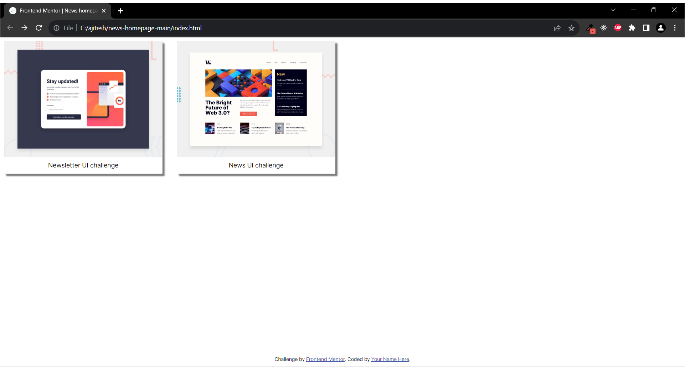
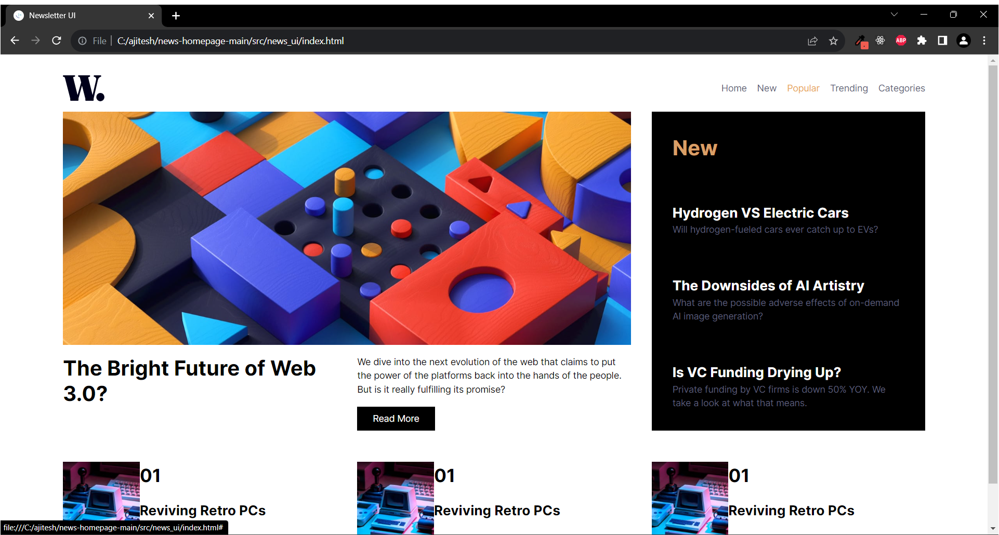
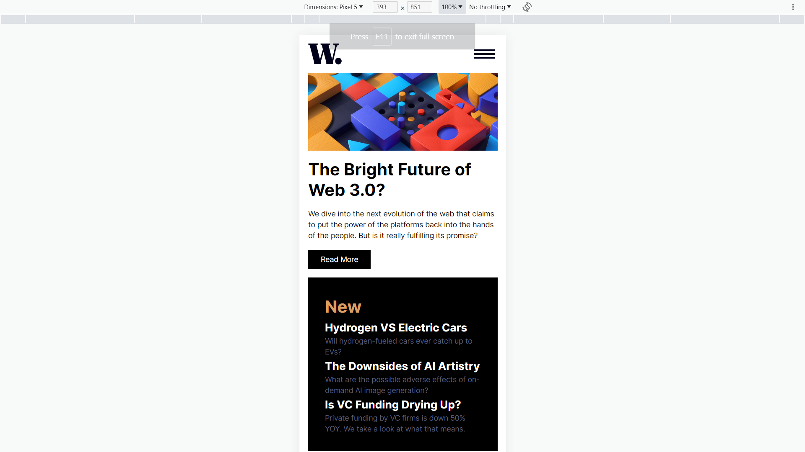

# UI Practice - Repository info

This repository contains responsive web page layouts created with HTML, CSS/SASS and JS.

The pages are either a part of Frontend Mentor challenges or can be a dummy design picked up from the Internet. The appropriate links are included here in the README.

## Index home page

- The index page will contain links to all challenge pages
- The index page itself is a way to practise grid layout.

## [News homepage](https://www.frontendmentor.io/challenges/news-homepage-H6SWTa1MFl) layout challenge from Frontend Mentor

- The news page layout is created in HTML, SASS and JavaScript
- The news page is responsive and has appropriate hover and focus states as presented in the design.

### Screenshots

- Index page
  

- News page
  
  
  
